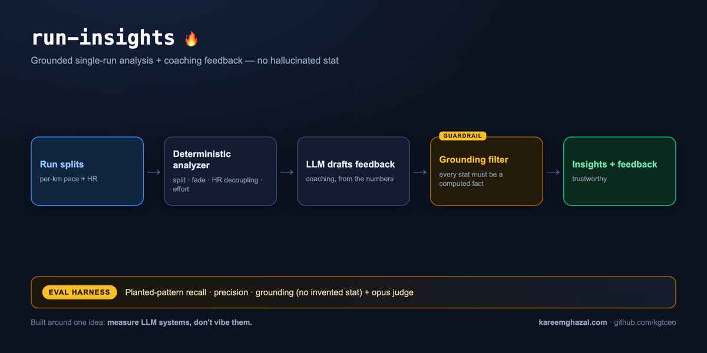

# run-insights

### ▶ Live demo: **[run-insights.kareemghazal.com](https://run-insights.kareemghazal.com)**

Enter a run's per-km splits (or "Load sample") and get the objective facts — split, pace fade, HR
decoupling, effort type — plus a short coaching note grounded in exactly those numbers.
(First run ~10–20s.)

> **Illustrative demo — not coaching or medical advice.** It summarises objective numbers from a
> single run; it doesn't know your training history, health, or goals. Synthetic data only.



Feed it one run's splits — a list of `{km, pace, hr}` plus total distance and elevation. A
**deterministic analyzer** (pure arithmetic, no LLM) computes:

- **split** — negative if the 2nd half was faster, positive if slower;
- **pace fade** — % slowdown of the last km vs the first;
- **HR drift / decoupling** — the 2nd-half HR:pace ratio vs the 1st half (>~5% flags aerobic decoupling);
- **effort type** — easy / tempo / interval / long, from the pace variability vs the run's own median;
- **average pace / HR**.

Then an LLM drafts a short **coaching note** — but it may only use the numbers above. A **grounding
filter** drops any numeric claim in the note (a pace `m:ss`, an HR `NNN bpm`, a `N%`) that isn't one
of the computed facts, so it **can't hallucinate a stat**; if it tries, the note falls back to a
safe, stat-free summary.

Built the same way as the other reviewers in this set: every stat is **grounded**, and it's gated by
a **planted-pattern eval set** — a positive-split-with-fade run and an HR-drift run it must catch, and
a clean, evenly-paced run it must **not** over-flag.

## Quickstart

```bash
pip install -e .
cp .env.example .env   # add ANTHROPIC_API_KEY

run-insights demo                        # analyze a baked-in synthetic run (positive split + fade)
run-insights demo --sample hr-drift-tempo
run-insights analyze --file run.json     # your own run
```

A `run.json`:

```json
{
  "splits": [
    { "km": 1, "pace": "5:12", "hr": 148 },
    { "km": 2, "pace": "5:10", "hr": 150 }
  ],
  "distance_km": 8.0,
  "elevation_m": 30
}
```

## Evals

```bash
python evals/run_evals.py             # recall / precision / grounding (deterministic gates)
python evals/run_evals.py --judge     # also an opus faithfulness / safety judge
```

- **Recall** — on a run with a planted pattern (positive split + fade, HR drift), the analyzer raises the planted flag.
- **Precision** — on a clean, evenly-paced run, the analyzer doesn't over-flag.
- **Grounding** — every pace / HR / % in the drafted feedback is a computed fact.
- **Judge** — opus scores faithfulness (invents no stat), usefulness, and safety (no medical advice).

**Latest run (claude-sonnet-4-6, opus judge):** all gates pass — every planted pattern is flagged
(positive-split + fade, HR decoupling), clean runs aren't over-flagged, every pace/HR/% in the
feedback is a computed fact (no invented stat), and the opus judge scores **faithfulness / usefulness
/ safety 5/5**.

## Tests

```bash
pytest -q   # offline: the analyzer's split/fade/decoupling math + the grounding filter dropping a
            # fabricated pace (fake client, no API key)
```

## Web

`web/` — a Next.js UI: enter a run's splits, get the computed facts + flags + the grounded coach
note, with the not-coaching/not-medical-advice banner throughout.

Run it locally in two terminals:

```bash
# terminal 1 — the API
pip install -e .
cp .env.example .env                  # add ANTHROPIC_API_KEY
python -m uvicorn run_insights.api:app --port 8000

# terminal 2 — the UI
cd web
npm install
echo "NEXT_PUBLIC_API_URL=http://localhost:8000" > .env.local
npm run dev                           # open http://localhost:3000
```

See [DEPLOY.md](./DEPLOY.md).

## License

MIT — see [LICENSE](./LICENSE).
